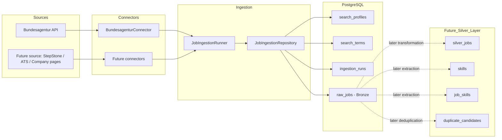

# Job Application Pipeline

A portfolio and learning project focused on building a realistic data engineering pipeline for ingesting, storing, normalizing, and analyzing job postings from real-world job market sources.

The project intentionally focuses on practical engineering decisions instead of tutorial-style implementations. The goal is to simulate realistic ingestion challenges such as heterogeneous source systems, duplicate handling, normalization, and later semantic matching against personal skill profiles and CV data.

---

# Goals

* Build a local-first data engineering pipeline
* Work with real job market sources instead of static demo datasets
* Preserve raw source data for reproducibility and traceability
* Handle duplicate postings across multiple sources
* Prepare for later normalization and analytics layers
* Generate matching metrics between job postings and a personal CV/profile
* Create a realistic portfolio project demonstrating engineering tradeoffs and architectural decisions

---

# Current Status

Implemented:

* PostgreSQL-based Bronze layer
* Dockerized local PostgreSQL environment
* Search-profile-based ingestion
* Bundesagentur für Arbeit API ingestion
* Duplicate prevention on source identifiers
* Ingestion run tracking
* Connector-based ingestion architecture
* Architecture Decision Records (ADR)

Planned:

* Additional job sources
* Connector registry
* Silver-layer normalization
* Skill extraction
* Duplicate candidate detection
* Company normalization
* Location normalization
* Gold-layer analytics and matching
* Dashboards and KPI generation

---

# Architecture

The ingestion layer follows a connector-based architecture.

Source-specific access logic is implemented in connectors, while the ingestion runner handles orchestration and the repository handles database persistence.

This keeps the Bronze layer source-preserving and prepares the project for adding further sources and later Silver-layer normalization.



---

# Project Structure

```text
job-application-pipeline/
│
├── db/
│   ├── migrations/
│   └── seeds/
│
├── docs/
│   ├── adr/
│   └── diagrams/
│
├── src/
│   ├── connectors/
│   ├── ingestion/
│   └── ingest_jobs.py
│
├── docker-compose.yml
├── requirements.txt
└── README.md
```

---

# Bronze Layer Philosophy

The Bronze layer intentionally stores minimally transformed source data.

This preserves:

* original source payloads
* traceability
* reproducibility
* reprocessing capability

Normalization and interpretation are intentionally postponed to later pipeline stages.

---

# Future Silver Layer

The Silver layer is intended to transform and normalize raw source data into reusable analytical entities.

Planned Silver entities include:

* normalized job postings
* normalized companies
* normalized locations
* extracted skills
* duplicate candidates
* semantic enrichments

Example future tables:

```text
silver_jobs
skills
job_skills
duplicate_candidates
normalized_companies
normalized_locations
```

---

# Future Gold Layer

The Gold layer is intended for analytics and matching use cases.

Planned examples:

* CV-to-job matching
* skill gap analysis
* job market trend analysis
* heatmaps
* ranking scores
* dashboards

---

# Technologies

Current stack:

* Python
* PostgreSQL
* Docker
* psycopg
* requests

Planned additions:

* SQLAlchemy or dbt evaluation
* Apache Airflow evaluation
* Semantic matching approaches
* Visualization layer
* Cloud deployment evaluation

---

# ADRs

Architecture decisions are documented inside:

```text
docs/adr/
```

The project intentionally tracks architectural tradeoffs and reasoning as part of the learning and portfolio process.

---

# Local Setup

## Start PostgreSQL

```bash
docker compose up -d
```

## Run ingestion

```bash
python -m src.ingest_jobs
```

---

# Design Principles

* Local-first development
* Real-world data instead of demo datasets
* Source-preserving ingestion
* Incremental architecture evolution
* Explicit architectural documentation
* Reproducibility over convenience
* Practical engineering tradeoffs
