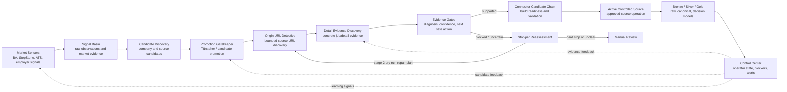
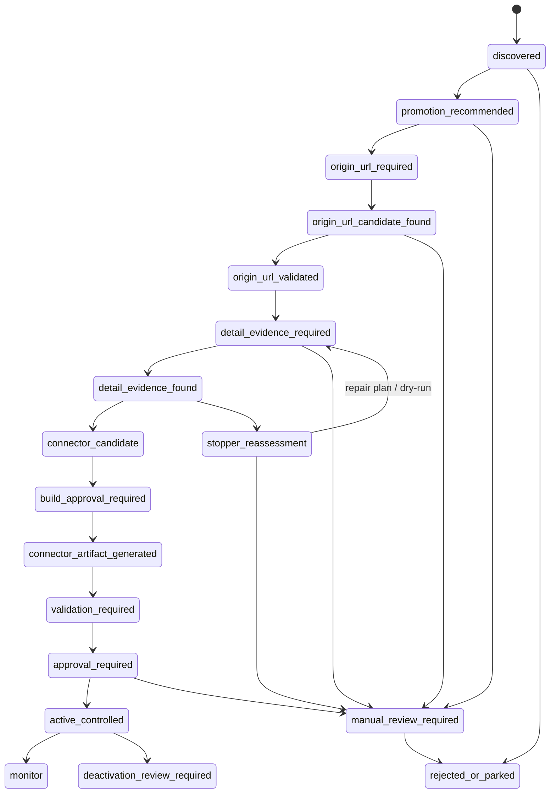
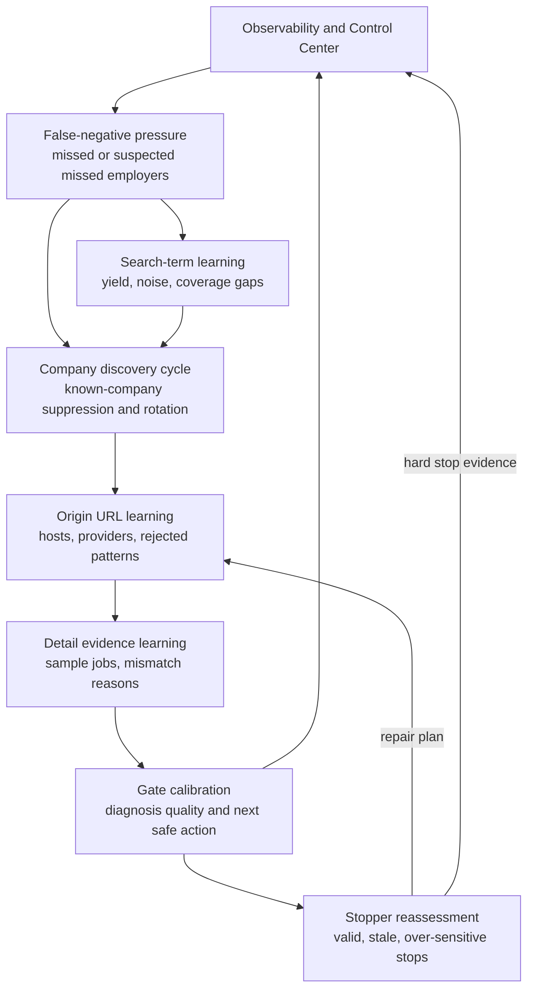
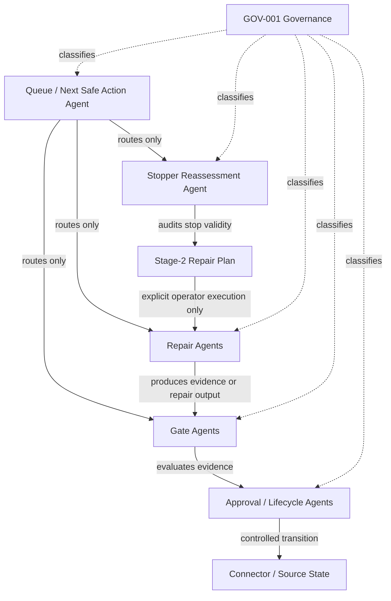
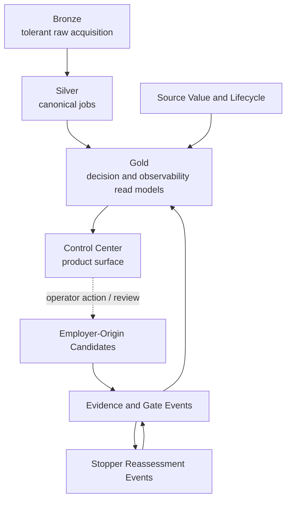
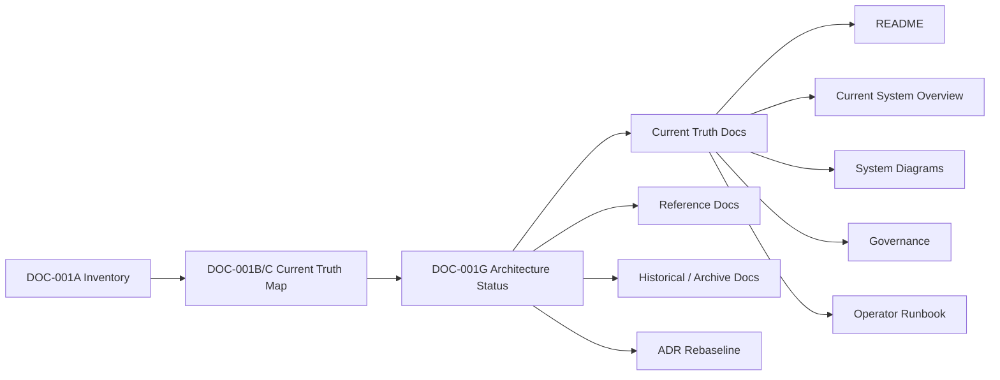

# Current System Diagrams

Status: current truth
Scope: DOC-001G architecture diagram rebaseline
Last rebaseline: DOC-001G

## Purpose

This document is the current diagram entry point for the project.

The diagrams follow the Deep Ocean / Search Intelligence design language, but
they stay GitHub-friendly and maintainable. Mermaid diagrams are preferred
because architecture visuals must be reviewable, versioned and easy to update.

Older diagrams may still be useful historically, but this file represents the
current architecture story after DOC-001G.

## End-to-end Search Intelligence control surface

## Candidate and connector lifecycle

## Learning and repair loops

## Agent responsibility boundaries

## Data and decision layers

## Documentation rebaseline model

## Diagram maintenance rule

This file should be updated when:

- a new product-agent responsibility is introduced,
- a pipeline stage changes responsibility,
- a new gate/stage changes candidate progression,
- a new learning or repair loop becomes part of the intended architecture,
- the Current Truth documentation map changes,
- DOC-001 archives or promotes a major documentation area.

It should not be updated for every small helper script, planning note, or runtime
report.
