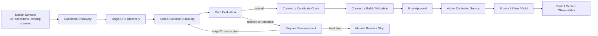
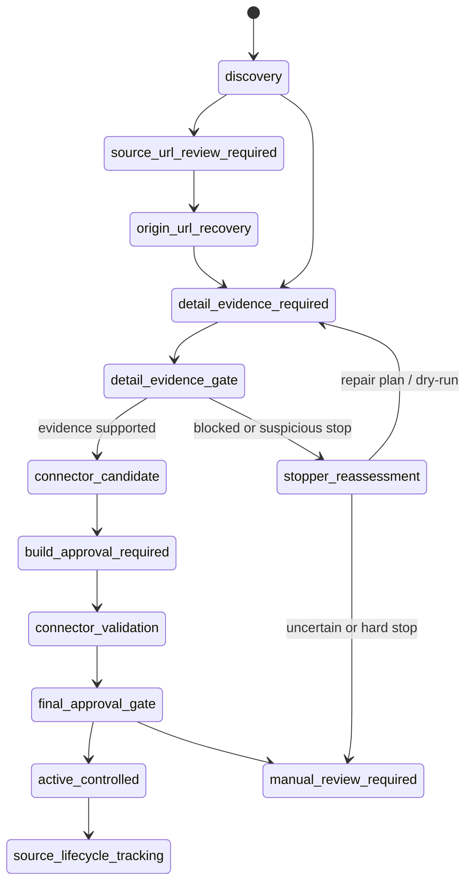
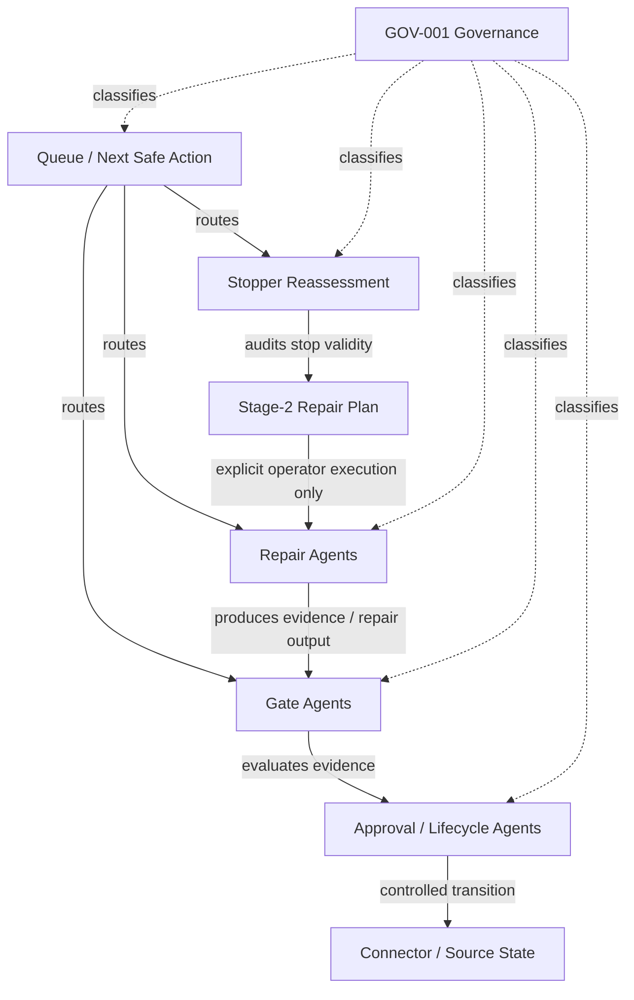
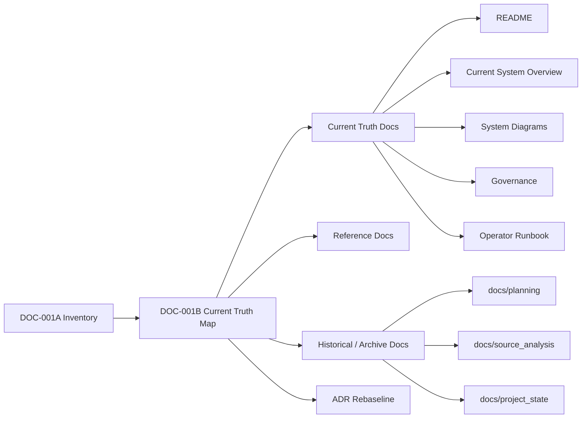
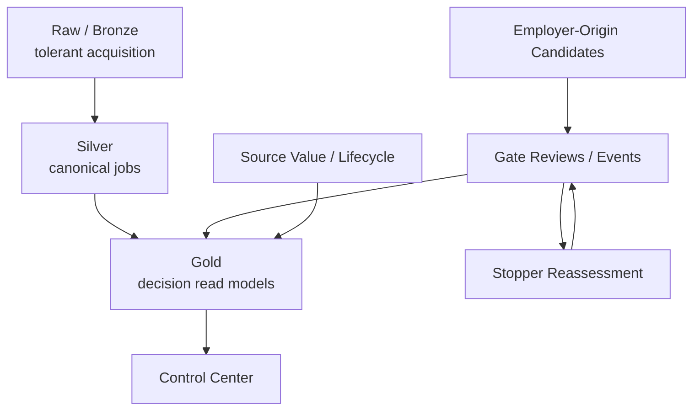

# Current System Diagrams

Status: current truth candidate  
Scope: DOC-001B diagram rebaseline  
Last rebaseline: DOC-001B

## Purpose

This document contains the current high-level system diagrams for the project.

Older diagrams may still be useful historically, but this file is intended to
be the current diagram entry point after DOC-001.

## Search Intelligence pipeline

## Candidate lifecycle view

## Governance and responsibility boundaries

## Documentation rebaseline model

## Data and decision layers

## Diagram maintenance rule

This file should be updated when:

- a new product-agent responsibility is introduced,
- a pipeline stage changes responsibility,
- a new gate/stage changes candidate progression,
- the Current Truth documentation map changes,
- DOC-001 archives or promotes a major documentation area.

It should not be updated for every small helper script, planning note, or runtime
report.
