# Current System Diagrams

Status: current truth  
Active product track: **PRODUCT-RECOVERY-001 / issue #783**  
Release checkpoint: `v0.1.0-demo.1`

## Purpose

These diagrams show the current product architecture after DEMO-001 salvage. They deliberately distinguish discovery provenance, Employer-Origin authority, currentness, Product V1 ranking and application preparation while preserving the bounded Search Intelligence discovery and repair loops that feed the product path.

## End-to-end Search Intelligence control surface

The bounded acquisition/control layer remains upstream of Product V1. `Promotion Gatekeeper` controls which discoveries may advance; `Origin URL Detective` resolves bounded source evidence before Employer-Origin/current-vacancy authority is claimed.

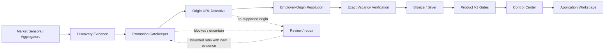

## Learning and repair loops

Search Intelligence remains evidence-driven rather than fail-open. Suspected false negatives, source gaps, rejected origin patterns and stale/detail-drift findings feed bounded learning or repair; they do not silently grant Product authority.

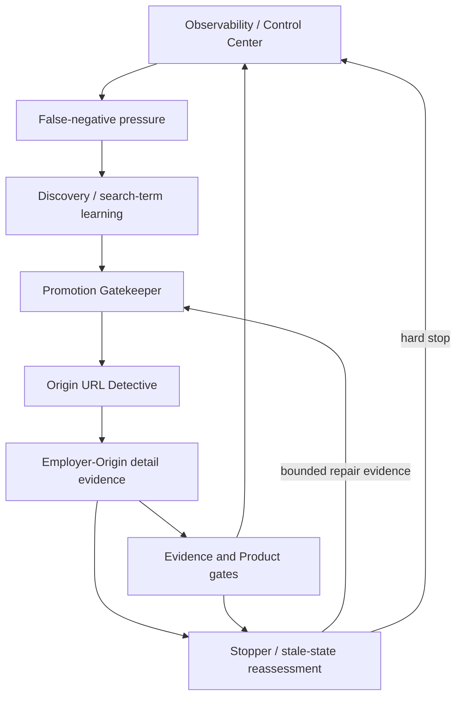

## 1. End-to-end product-value flow

```mermaid
flowchart LR
    S0[Market Sensors / Aggregators<br/>BA, StepStone, source feeds]
    S1[Discovery Evidence<br/>employer + job observations]
    S2[Employer-Origin Resolution<br/>career/ATS/source authority]
    S3[Exact Vacancy Verification<br/>current detail + fingerprint]
    S4[Bronze<br/>raw observation + lineage]
    S5[Silver<br/>canonical job]
    S6[Assessment<br/>current vacancy-bound evidence]
    S7[Capability Fit + Hard Filters]
    S8[Deterministic Ranking<br/>rankable]
    S9[Top-5 Policy<br/>score >= 70, max 5]
    S10[Control Center<br/>review + evidence]
    S11[Application Workspace]
    S12[CV + Letter<br/>DOCX / PDF / ZIP<br/>draft_for_review]

    S0 --> S1 --> S2 --> S3 --> S4 --> S5 --> S6 --> S7 --> S8 --> S9 --> S10 --> S11 --> S12

    S1 -.aggregator-only / unresolved.-> D0[Discovery-only lane]
    S3 -.closed / stale / unverifiable.-> H0[Historical / blocked]
    S7 -.fail / required unknown.-> R0[Review / evidence required]
    S8 -.below 70.-> R1[Rankable but not recommended]
```

## 2. Discovery truth vs Product action truth

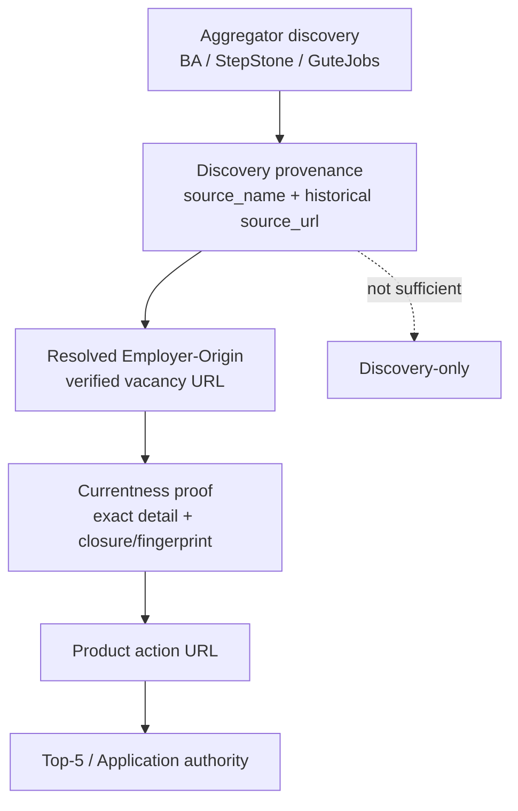

Core invariant:

```text
where a job was discovered != where Product/Application action authority comes from
```

## 3. Currentness and detail-drift loop

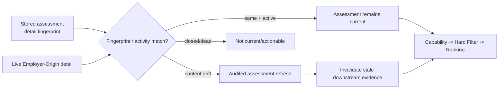

## 4. Rankable vs recommended

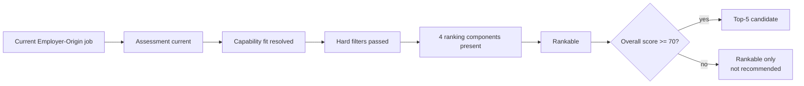

`PD-050/PD-051` remain product authority: Top 5 is at most five and is not filled with below-threshold jobs.

## 5. Application preparation authority

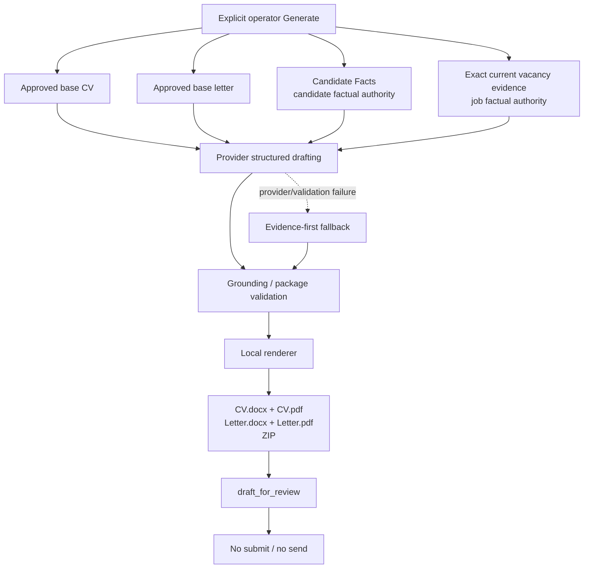

## 6. Data layers and observability

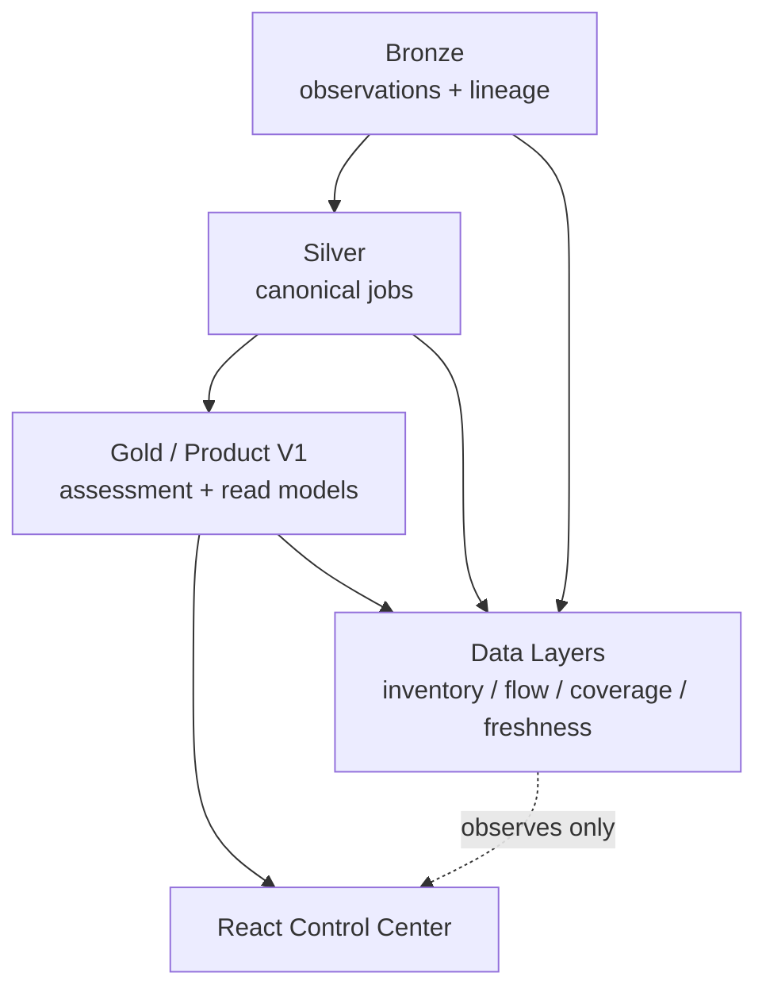

Data-layer metrics are observability. They do not create ranking, source activation or application authority.

## 7. Employer/source acquisition lifecycle

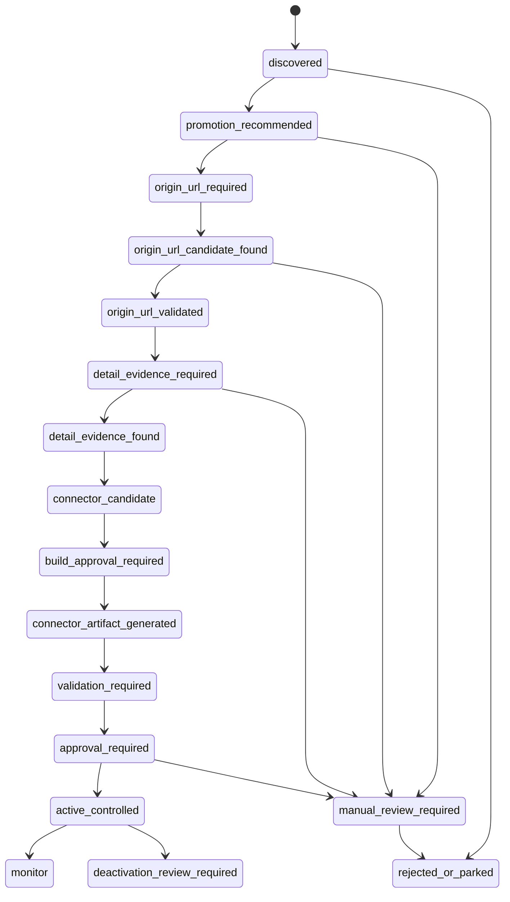

## 8. Product Recovery architecture target

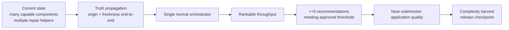

The target is not another demo-only coordinator. The target is one normal observable product path that produces the same truthful outcome from cold state.

## 9. Release and proof model

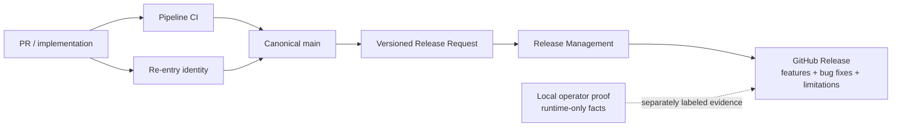

CI is not a substitute for live PostgreSQL/provider/employer-HTTP evidence. Local operator proof is not portable repository state.

## Diagram maintenance rule

Update this file when:

- an authority boundary changes;
- the normal cold-to-application path changes;
- a Product V1 stage or hard gate changes responsibility;
- application-generation authority changes;
- release/proof behavior changes materially;
- PRODUCT-RECOVERY-001 retires or consolidates a major recovery path.

Do not update it for every helper script or historical repair experiment.
