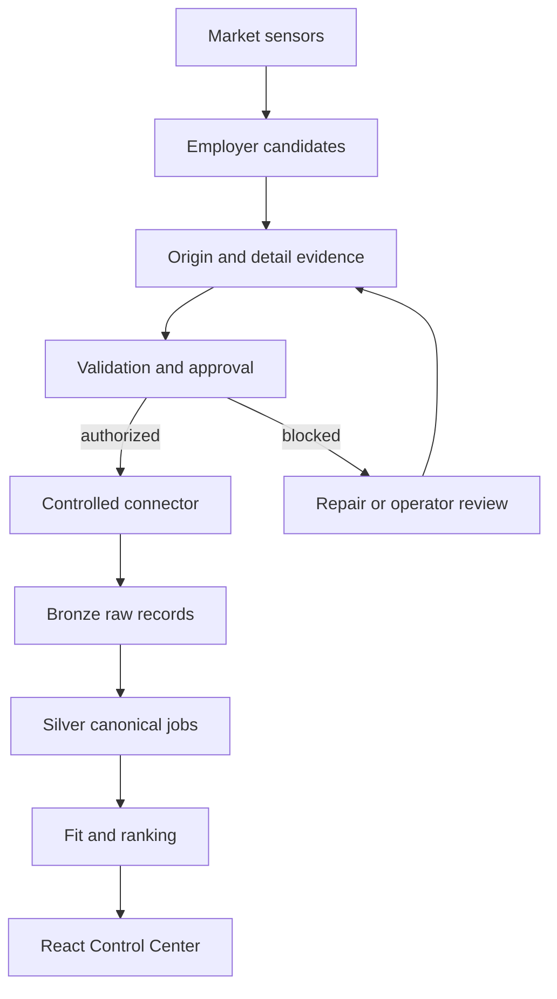
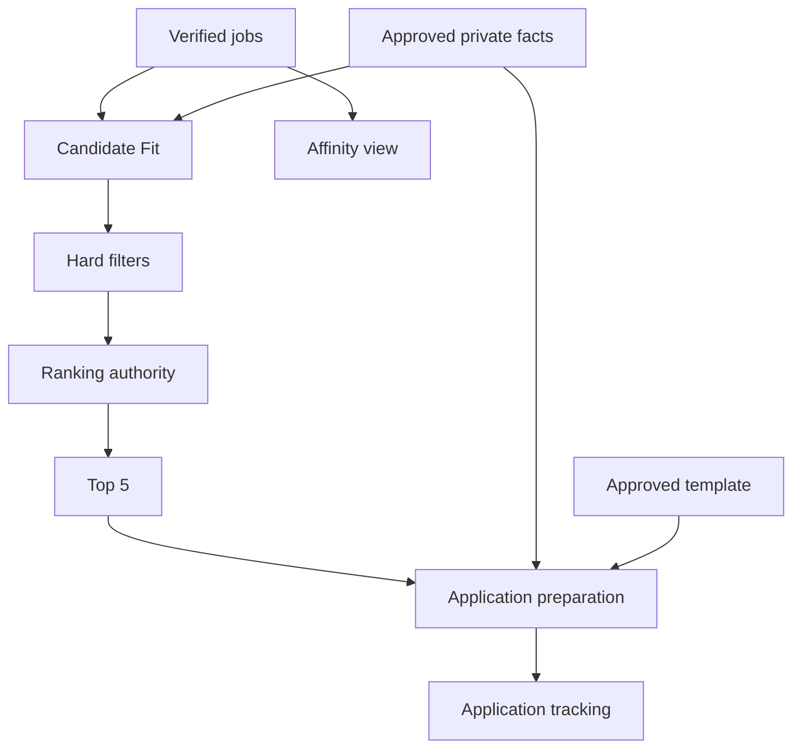
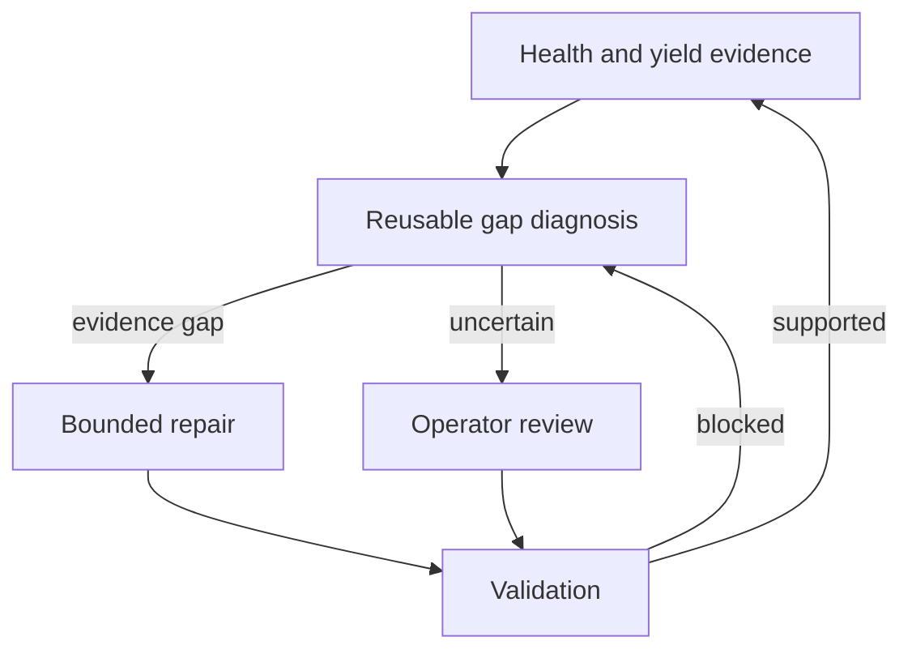
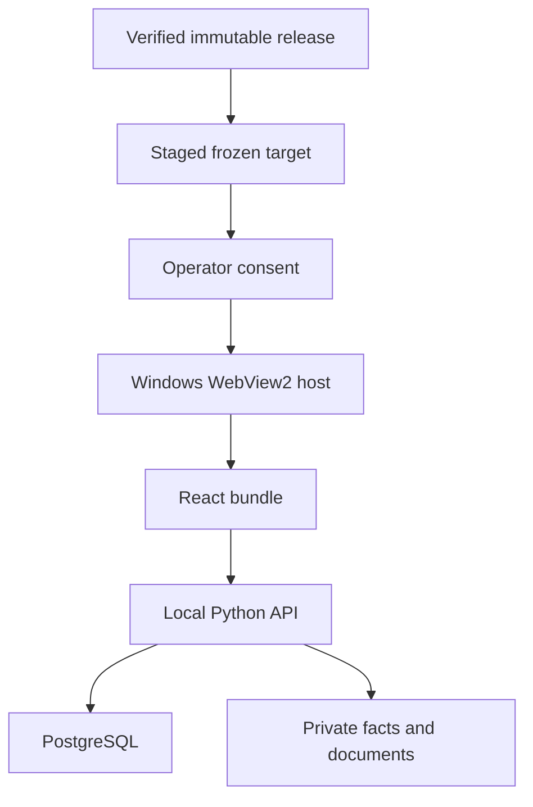
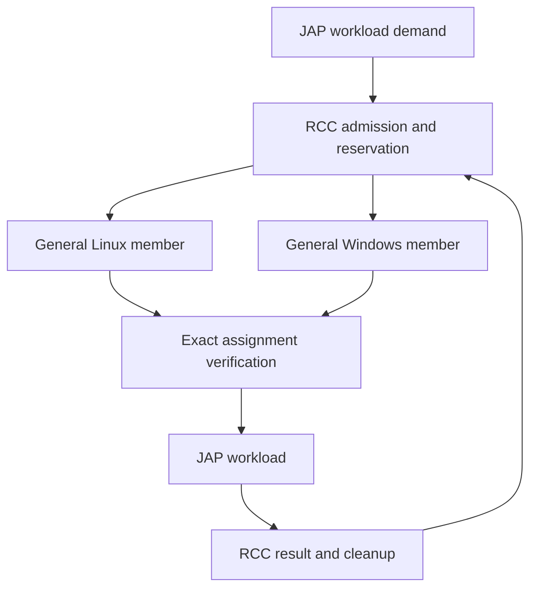

# Current system diagrams

These diagrams describe responsibilities. Runtime arrows do not prove live acceptance.

## End-to-end Search Intelligence control surface

```mermaid
flowchart TD
    Sensor[Market sensors] --> Candidate[Employer candidates]
    Candidate --> Evidence[Origin and detail evidence]
    Evidence --> Gate[Validation and approval]
    Gate -->|authorized| Connector[Controlled connector]
    Gate -->|blocked| Review[Repair or operator review]
    Review --> Evidence
    Connector --> Bronze[Bronze raw records]
    Bronze --> Silver[Silver canonical jobs]
    Silver --> Product[Fit and ranking]
    Product --> UI[React Control Center]
```

## Product decisions

```mermaid
flowchart TD
    Jobs[Verified jobs] --> Fit[Candidate Fit]
    Facts[Approved private facts] --> Fit
    Jobs --> Affinity[Affinity view]
    Fit --> Filter[Hard filters]
    Filter --> Ranking[Ranking authority]
    Ranking --> Top[Top 5]
    Top --> Draft[Application preparation]
    Facts --> Draft
    Template[Approved template] --> Draft
    Draft --> Track[Application tracking]
```

Affinity is separately explained; no combined-score edge exists. Preparation is not sending.

## Learning and repair loops

```mermaid
flowchart TD
    Health[Health and yield evidence] --> Diagnose[Reusable gap diagnosis]
    Diagnose -->|evidence gap| Repair[Bounded repair]
    Diagnose -->|uncertain| Review[Operator review]
    Repair --> Validate[Validation]
    Review --> Validate
    Validate -->|supported| Health
    Validate -->|blocked| Diagnose
```

Health and yield are separate dimensions. Zero relevant jobs is not a technical failure.
Promotion Gatekeeper and Origin URL Detective describe discovery/evidence responsibilities,
not an autonomous approval loop.

## Runtime and presentation

```mermaid
flowchart TD
    Host[Windows WebView2 host] --> UI[React bundle]
    UI --> API[Local Python API]
    API --> DB[PostgreSQL]
    API --> Private[Private facts and documents]
    Update[Verified immutable release] --> Stage[Staged frozen target]
    Stage --> Consent[Operator consent]
    Consent --> Host
```

The installed updater owns transactional cutover/rollback. WSL supplies the private local
execution environment. Runtime identity, not checkout location, proves installed source.

## RCC assignment boundary

```mermaid
flowchart TD
    Demand[JAP workload demand] --> RCC[RCC admission and reservation]
    RCC --> Linux[General Linux member]
    RCC --> Windows[General Windows member]
    Linux --> Verify[Exact assignment verification]
    Windows --> Verify
    Verify --> Work[JAP workload]
    Work --> Cleanup[RCC result and cleanup]
    Cleanup --> RCC
```

JAP supplies requirements and exact product source; RCC chooses capacity and owns lifecycle.
No fixed members, cardinality or hosted fallback are implied.
