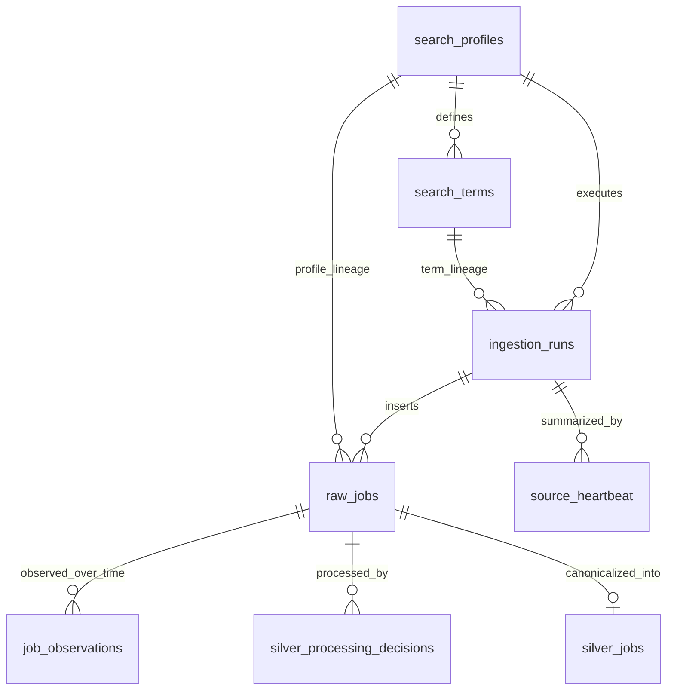
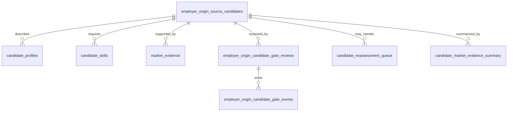
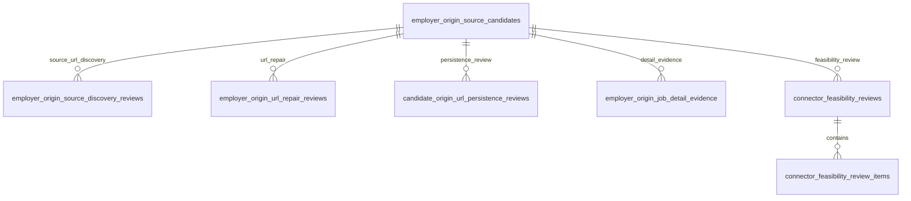
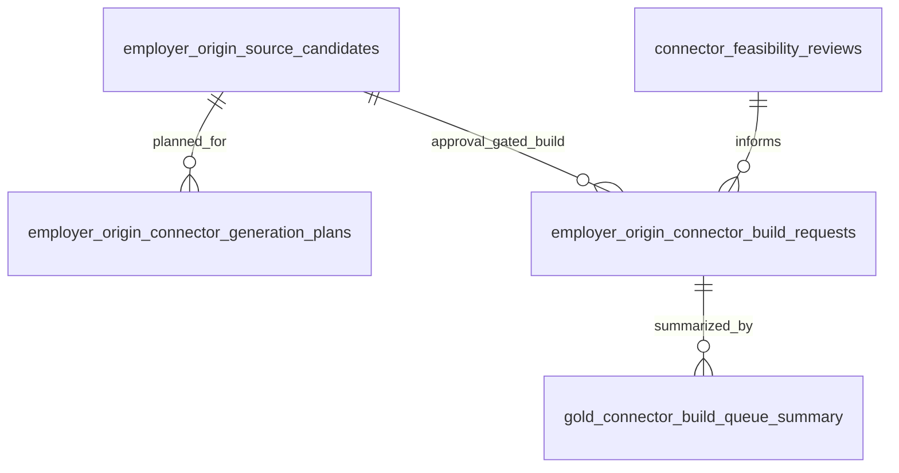
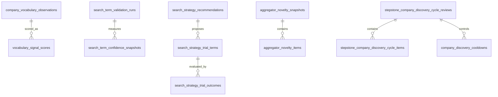
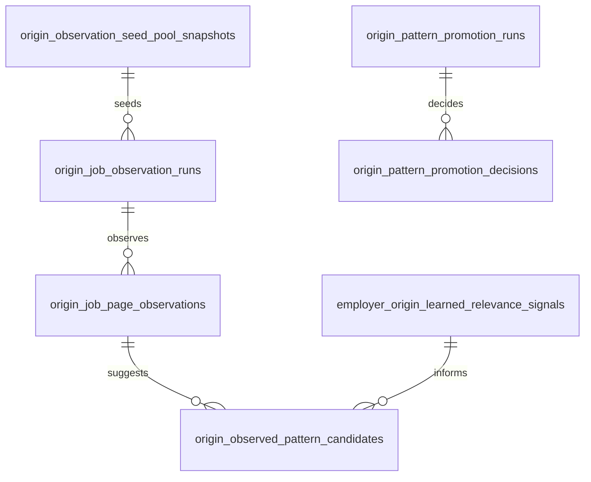
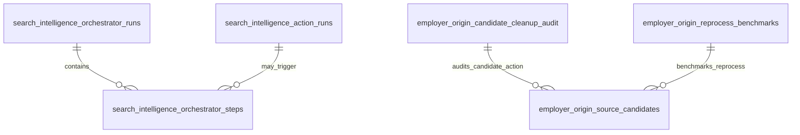

# Database Schema Relationships

Status: current schema relationship map
Scope: DOC-001H table/view network overview

## Purpose

This document shows the main database networks behind the Search Intelligence
pipeline. It is deliberately split into smaller Mermaid diagrams so GitHub can
render and reviewers can reason about one domain at a time.

## Ingestion, Bronze and Silver

Boundary: ingestion creates source-preserving Bronze records first. Silver and
Gold/read models must not erase raw source lineage.

## Employer-Origin Candidate and Gate Network

Boundary: the gate network is the product's “Türsteher”. It must explain both
positive progression and negative stops with comparable rigor.

## Evidence, URL Discovery and Repair

Boundary: weak URLs and weak detail evidence should lead to repair/review states,
not silent connector activation.

## Connector Build and Approval Governance

Boundary: generated connector artifacts are not the same as registered or active
connectors. Build, validation and final approval remain separate gates.

## Search Intelligence Learning and Market Sensors

Boundary: aggregators are market sensors and discovery inputs. They must not turn
into uncontrolled scraping or hidden source-of-truth shortcuts.

## Origin Observation and Pattern Learning

Boundary: origin observation is a learning system. It should deduplicate known
seeds, detect saturation and use bounded revalidation rather than repeated blind
observation.

## Orchestrator, Actions and Audit

Boundary: dry-run/apply decisions and operator-facing actions need auditability.
This is the foundation for future safe UI actions.

## Current gap

The project has a useful schema map now, but not yet a generated full constraint
catalog.

A later block should add a read-only schema-inspection script that writes an
`exports/` report with:

- tables and views,
- columns and nullability,
- primary keys,
- foreign keys,
- unique constraints,
- check constraints,
- indexes,
- row counts where operationally useful.
