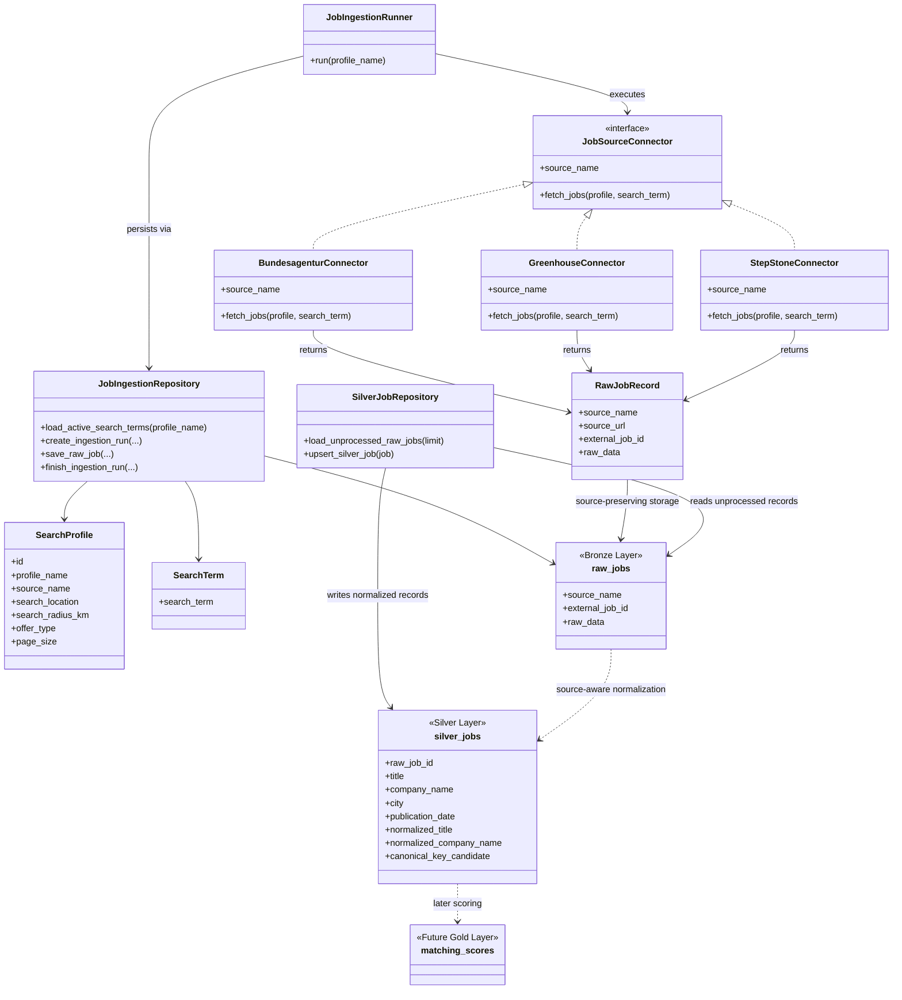

# Connector Architecture

## Boundary Notes

Connectors fetch and transport source-specific job data.

They do not perform business-level interpretation such as:
- skill extraction
- company normalization
- location normalization
- deduplication across sources
- CV-to-job matching

The Bronze layer stores source-preserving raw records.

The Silver layer provides a pragmatic canonical representation and now includes first-stage canonicalization fields for duplicate-candidate and source-value analysis.
