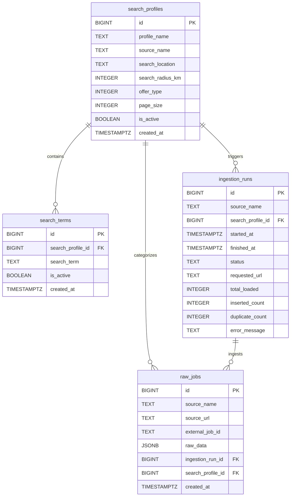

# Bronze Layer Data Model

```mermaid
erDiagram

    search_profiles {
        BIGINT id PK
        TEXT profile_name
        TEXT source_name
        TEXT search_location
        INTEGER search_radius_km
        INTEGER offer_type
        INTEGER page_size
        BOOLEAN is_active
        TIMESTAMPTZ created_at
    }

    search_terms {
        BIGINT id PK
        BIGINT search_profile_id FK
        TEXT search_term
        BOOLEAN is_active
        TIMESTAMPTZ created_at
    }

    ingestion_runs {
        BIGINT id PK
        TEXT source_name
        BIGINT search_profile_id FK
        TIMESTAMPTZ started_at
        TIMESTAMPTZ finished_at
        TEXT status
        TEXT requested_url
        INTEGER total_loaded
        INTEGER inserted_count
        INTEGER duplicate_count
        TEXT error_message
    }

    raw_jobs {
        BIGINT id PK
        TEXT source_name
        TEXT source_url
        TEXT external_job_id
        JSONB raw_data
        BIGINT ingestion_run_id FK
        BIGINT search_profile_id FK
        TIMESTAMPTZ created_at
    }

    search_profiles ||--o{ search_terms : contains
    search_profiles ||--o{ ingestion_runs : triggers
    search_profiles ||--o{ raw_jobs : categorizes

    ingestion_runs ||--o{ raw_jobs : ingests
```
